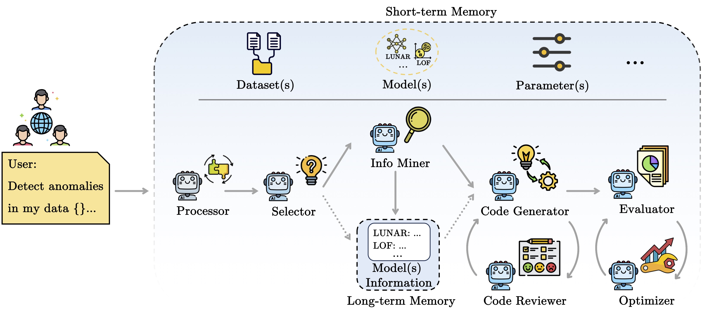
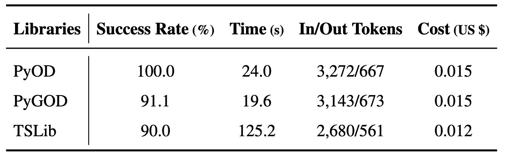
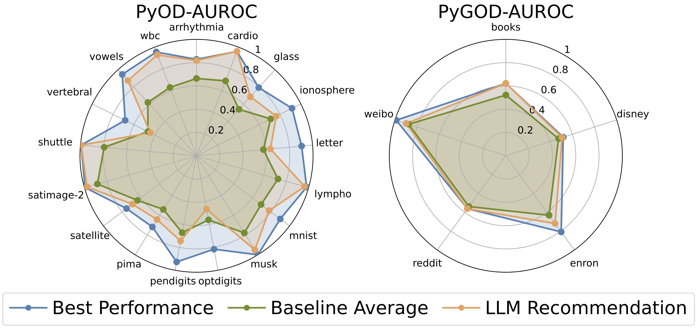

# AD-AGENT

**AD-AGENT** is an LLM-driven multi-agent framework for end-to-end anomaly detection. Describe the detection task or workflow you want to run in natural language, and AD-AGENT will pick a model, generate the code, validate it, and produce results — all through a coordinated pipeline of specialized agents.

**Website:** [https://usc-fortis.github.io/AD-AGENT/](https://usc-fortis.github.io/AD-AGENT/) &nbsp;•&nbsp; **Paper:** [arXiv:2505.12594](https://arxiv.org/abs/2505.12594)



> One platform. Multiple agents. End-to-end anomaly detection workflows, automated and explainable.

## Why AD-AGENT

Running anomaly detection across different data modalities usually means switching libraries, re-learning APIs, and wiring up evaluation code by hand. AD-AGENT collapses that loop: a prompt describing the task you want to solve — *"Run IForest on cardio.mat"*, *"Detect anomalies in my time-series data"*, or *"Try all PyOD models on this dataset"* — is turned into a working script, executed in a secure agent environment, and evaluated end-to-end.

## Citation

If you find AD-AGENT helpful in your research, please cite our paper: [https://arxiv.org/abs/2505.12594](https://arxiv.org/abs/2505.12594)

```bibtex
@inproceedings{yang2025ad,
  title={AD-AGENT: A Multi-agent Framework for End-to-end Anomaly Detection},
  author={Yang, Tiankai and Liu, Junjun and Siu, Michael and Wang, Jiahang and Qian, Zhuangzhuang and Song, Chanjuan and Cheng, Cheng and Hu, Xiyang and Zhao, Yue},
  booktitle={Proceedings of the 14th International Joint Conference on Natural Language Processing and the 4th Conference of the Asia-Pacific Chapter of the Association for Computational Linguistics},
  pages={191--205},
  year={2025}
}
```

## Features

- **Natural-language workflow generation.** Go from a sentence to a runnable anomaly detection script.
- **Multi-agent orchestration.** Decoupled agents handle model selection, documentation lookup, code generation, review, and evaluation.
- **Cross-library support.** Works across `pyod` (tabular), `pygod` (graph), and `tsb_ad` (time-series).
- **Pipeline API.** Call `api.pipeline` stages directly from Python to embed AD-AGENT in notebooks, scripts, or larger workflows.
- **Automatic model suggestion.** When no algorithm is specified, the selector agent recommends competitive candidates based on the data and task.
- **Secure agent execution.** Generated code runs inside an isolated sandbox environment rather than the host process. See [src/sandbox/README.md](./src/sandbox/README.md) for details.

## Installation

### 1. Clone the repository

```bash
git clone git@github.com:USC-FORTIS/AD-AGENT.git
cd AD-AGENT
```

### 2. Create a virtual environment

macOS / Linux:

```bash
python -m venv .venv
source .venv/bin/activate
```

Windows:

```bash
python -m venv .venv
.venv\Scripts\activate
```

### 3. Install Python dependencies

```bash
pip install -r requirements.txt
```

### 4. Configure your OpenAI API key

Set `OPENAI_API_KEY` in your environment, or place it in `src/config/config.py`.

```bash
export OPENAI_API_KEY=your-api-key-here
```

## Quick Start

Launch the interactive CLI:

```bash
python main.py
```

Then type a natural-language request, for example:

```text
Run IForest on ./data/pyod_data/cardio.mat
Run DOMINANT on ./data/pygod_data/books.pt
Run IForest on ./data/SMAP/SMAP_train.npy
Run all on ./data/pyod_data/cardio.mat
```

Additional modes:

```bash
python main.py -p    # parallel execution across tools
python main.py -o    # optimizer mode
python main.py --sandbox docker
```

## Sandbox Execution

Generated code is executed inside a sandbox rather than on the host. AD-AGENT ships with two backends:

- `modal` — remote, the default
- `docker` — local container

Select one explicitly with `--sandbox`:

```bash
python main.py --sandbox docker
python main.py --sandbox modal
```

For environment variables, Modal setup, data mounting, and debug logging, see [src/sandbox/README.md](./src/sandbox/README.md).

## Pipeline API

The pipeline stages can also be driven directly from Python — useful when embedding AD-AGENT into a larger workflow or a notebook. Until the project is packaged, run from the repository root with `src` on `PYTHONPATH`.

```bash
PYTHONPATH=src python your_script.py
```

Example:

```python
from api.pipeline import build_state, run_selector, run_info_miner

state = build_state()
state["experiment_config"] = {
    "algorithm": ["IForest"],
    "dataset_train": "./data/pyod_data/cardio.mat",
    "dataset_test": None,
    "parameters": {},
}

state = run_selector(state=state)
doc_state = run_info_miner(state=state)
print(doc_state["algorithm_doc"][:200])
```

See `src/api/pipeline.py` for the full set of stages (`run_code_generator`, `run_reviewer`, `run_evaluator`, loop helpers, and more).

## Repository Layout

```text
.
├── main.py
├── requirements.txt
├── src/
│   ├── agents/      # agent implementations
│   ├── api/         # reusable pipeline entry points
│   ├── config/      # configuration and API keys
│   ├── models/      # shared data models
│   ├── sandbox/     # Docker and Modal sandbox logic
│   └── utils/
├── tests/
├── data/            # example datasets
└── assets/
```

## Testing

Full test suite:

```bash
.venv/bin/python -m pytest tests/ -v --ignore=tests/legacy
```

Core regression subset:

```bash
.venv/bin/python -m pytest \
  tests/test_agent_selector.py \
  tests/test_agent_info_miner.py \
  tests/test_agent_code_generator.py \
  tests/test_pipeline_interface.py \
  tests/test_agent_reviewer.py \
  tests/test_agent_evaluator.py \
  tests/test_main_orchestration.py -q
```

## Project Status

This repository is in active refactor toward a stable, installable library. Current caveats:

- `main.py` still injects `src/` into `sys.path` as a transition measure.
- A `pip install` distribution is planned but not yet published.
- The public API surface is still being stabilized.

## Experiments

- Pipeline generation performance by library, showing success rate, latency, token usage, and cost. 
- Model selection results for PyOD and PyGOD. 

## Contributors

<a href="https://github.com/USC-FORTIS/AD-AGENT/graphs/contributors">
  
</a>

Made with [contrib.rocks](https://contrib.rocks).
